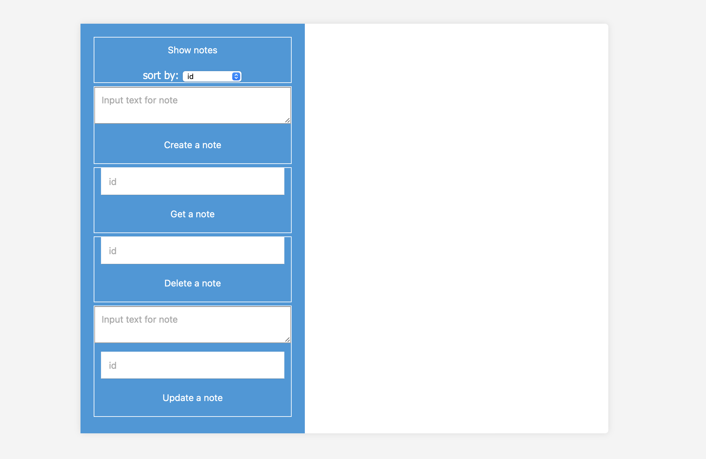

# Сервис заметок


## Сервис для заметок
**MySQL + Rest API**
```
Возможности:
  - Просмотреть все заметки, отсортированные по (id, тексту, дата загрузки, дата обновления)
  - Создать заметку
  - Получить одну заметку
  - Удалить заметку
  - Редактировать заметку
```


## Инструкция по запуску
```
git clone https://github.com/akrovv/note.git
docker-compose up
```

## Стек технологий
Backend: Golang, MySQL, Rest API, docker-compose. Frontend: JS.

## Особенности

- Mock для БД для тестирования handler **(make test)**
- CI-CD для push **(lint+test)**, merge **(lint+test+deploy)**
- Расширен golangci-lint файл

## Пример интерфейса


## Документация

### Просмотреть все заметки - GET /note
Дополнительно может быть передан query-параметр - **order_by**, с возможностью сортировки по возрастанию по id, text, created_at, updated_at. Если не передан - по умолчанию order_by = id.

**Принимает: -**  
**Возвращает: Массив в объектах в JSON**

Пример возможного запроса:
```bash
curl -X GET "localhost:8080/note"
```

Пример успешного ответа:

```json
[
    {
        "id": 1,
        "text": "note 1",
        "createdAt": "2024-01-27T00:24:51Z",
        "updatedAt": "2024-01-27T00:24:51Z"
    },
    {
        "id": 2,
        "text": "note 2",
        "createdAt": "2024-01-27T00:25:00Z",
        "updatedAt": "2024-01-27T00:25:00Z"
    }
]
```

### Создать заметку - POST /note

**Принимает: JSON в формате {"text": "text text..."}**  
**Возвращает: Сообщение об успехе/провале создания заметки**

Пример возможного запроса:
```bash
curl -X POST "http://localhost:8080/note" -H 'Content-Type: application/json' -d '{"text":"note 1"}'
```

Пример успешного ответа:

```json
{
    "response": "successfully created"
}
```

Пример неудачного ответа:

```json
{
    "error": "can't create a note"
}
```

### Получить одну заметку - GET /note/{id}

**Принимает: -**  
**Возвращает: Объект JSON**

Пример возможного запроса:
```bash
curl -X GET "localhost:8080/note/1"
```

Пример успешного ответа:

```json
{
    "id": 1,
    "text": "note 1",
    "createdAt": "2024-01-27T00:24:51Z",
    "updatedAt": "2024-01-27T00:24:51Z"
}
```
Пример неудачного ответа:

```json
{
    "error": "can't get a note"
}
```


### Удалить заметку - DELETE /note/{id}

**Принимает: -**  
**Возвращает: Сообщение об успехе/провале удаления заметки**

Пример возможного запроса:
```bash
curl -X DELETE "localhost:8080/note/3"
```

Пример успешного ответа:

```json
{
    "response": "successfully delete"
}
```

Пример неудачного ответа:

```json
{
    "error": "can't delete a note"
}
```

### Редактировать заметку - PUT /note/{id}

**Принимает: -**  
**Возвращает: Сообщение об успехе/провале редактирования заметки**

Пример возможного запроса:
```bash
curl -X PUT "http://localhost:8080/note/1" -H 'Content-Type: application/json' -d '{"text":"Sheldon Cooper"}'
```

Пример успешного ответа:

```json
{
    "response": "successfully updated"
}
```

Пример неудачного ответа:

```json
{
    "error": "can't update a note"
}
```